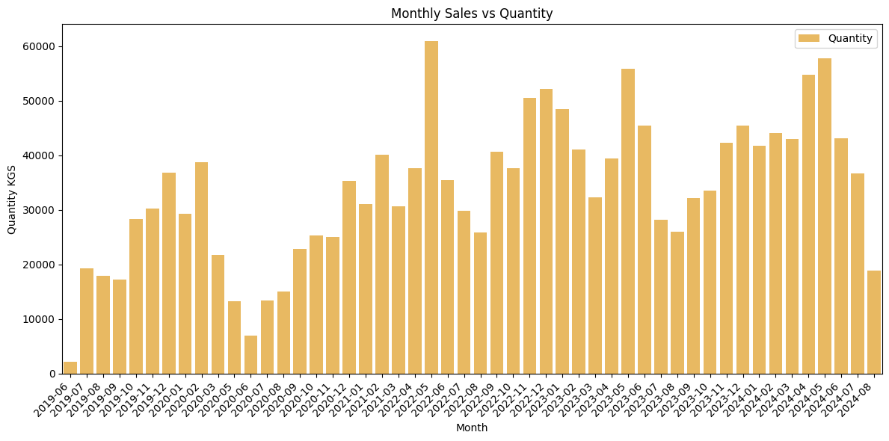
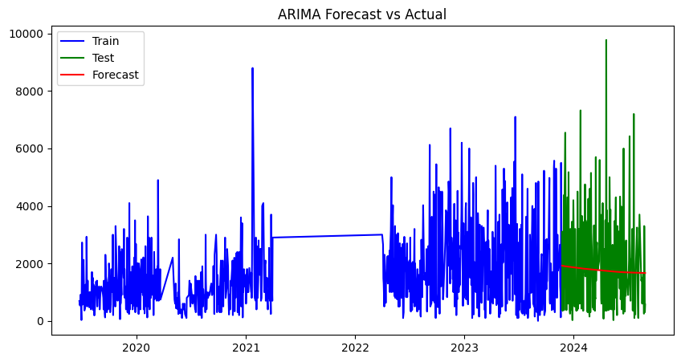
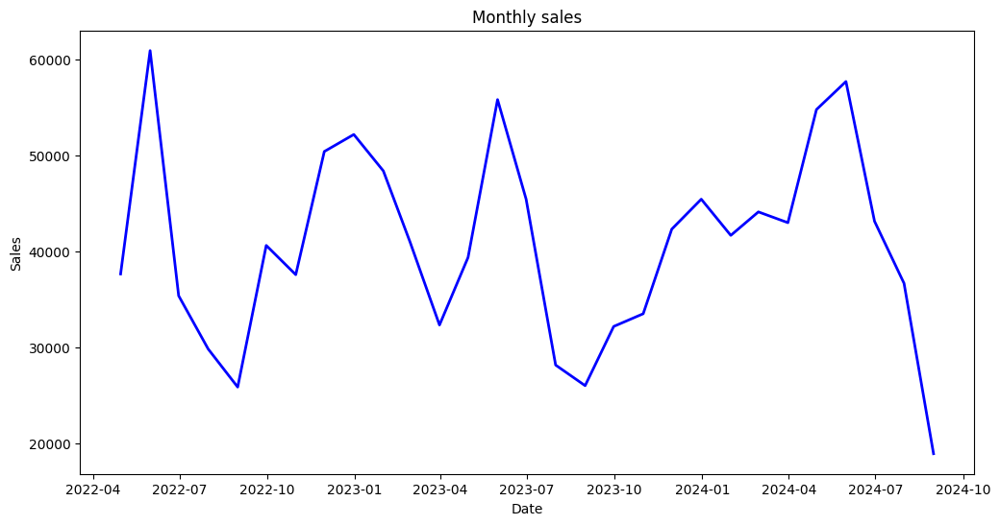

# ASTR Prediction Model

a very basic explanation from a novice making a machine learning model

---

- Future Improvements Suggested
  - [ ] Add granules price as a feature
  - [ ] extracting year, month, quarter, season, and day of the week from date⁠

## Introduction

ASTR Pet Industries is one of the leading PET preform manufacturer of central India I create this project with the aim to determine/predict the demand of preforms for the company to maintain enough quantity to crater the demand.

## Data Acquiring and Data Cleaning

First step was to gather the sales data from the erp software. So the company was setup in 2018 and was in production since 2019. So we currently have the data of about 6 years from 2019 to 2024. Now we have the year wise sales data in the excel format.

Next step was to clean the data. In this case the data was very mis managed. There were multiple values clubbed into one column. There very many anomalies which needed to be fixed.

So to clean the data for further steps I first of all organised all the data into one file then one by one using excel formulas and filters sorted the whole data, which is now ready to be used for the next steps.

This process could also be done using python, but since the data was very unorganised so I felt it easier to do it in excel itself.

---

## Exploratory Data Analysis and its conclusion

Bar Plot of the monthly sales

From the bar plot labeled **“Monthly Sales vs Quantity”**, we can infer several key trends and patterns regarding the **Quantity (in KGs)** sold over time (on a monthly basis):

1. **Seasonal Trends:**
   There are seasonal fluctuations in the data. The sales tend to rise and fall in a cyclical manner, particularly visible around the end of each year or early in the following year.
   Peaks in sales are evident in several months, for example, early **2020**, **2021**, and **2022**, while dips are seen particularly in mid-2020 and mid-2023. This may suggest seasonal demand fluctuations or external factors influencing production or sales during those periods.
2. **Overall Stability:**
   Despite fluctuations, there’s a relatively consistent range in the majority of sales quantities. It suggests that even though there are spikes and dips, the overall quantity stabilizes after recovery periods, indicating a somewhat resilient business model.
3. **Long-Term Growth and Declines:**
   Long-term, the data suggests periodic growth in sales quantity followed by subsequent dips. The cause of these dips is the market off-season, which is generally the monsoons (July-October)

---

---

## Trying Different Models and their inference

### Linear Regression:

While applying linear regression the MAE (mean absolute error) comes out to be very high.

MAE = ~9579.64

This linear regression model cannot capture relationship between date and quantity very well. This may be for various reasons such as:

1. **Time Series nature of data**: LR does not take into account the sequential nature of the data. This leads to poor performance, especially if there are trends, seasonality, or autocorrelations in the data.
2. **Scaling of DATE:** The DATE column is being converted into a numerical timestamp, which can result in very large values.  Large numeric values can skew the regression model. You may want to **normalize or scale** the DATE values before fitting the model.
3. **Non-linear Relationships:** Linear regression assumes a linear relationship between DATE (time) and Quantity. If the relationship between the time and quantity is **non-linear**, linear regression won’t capture that complexity, leading to higher errors.
   You could experiment with polynomial regression or other regression techniques like **Random Forest Regressor** or **Gradient Boosting**.

### Polynomial Regression:

MAE = ~ 9829.74

1. **Polynomial Degree Might Not Be Optimal:** You used a polynomial regression model of degree 2. It’s possible that a higher degree polynomial might fit the data better, but at the risk of **overfitting**. You can experiment with different polynomial degrees (e.g., 3, 4, 5), but higher degrees also introduce the risk of modeling noise rather than the underlying pattern.
2. **Time Series Patterns Not Captured:** Polynomial regression fits based on the numeric transformation of the DATE (timestamp), but it doesn’t take into account the **time series nature** of the data. Time series data often has trends, seasonality, and autocorrelation that linear and polynomial models fail to capture.
3. **Possible Non-Linear Relationship Between Time and Quantity: T**he relationship between DATE and Quantity is **non-linear**, but polynomial regression might not be flexible enough to model it. For instance, polynomial models assume that the underlying relationship is smooth, which might not be true for your data.
4. **Potential Data Anomalies or Trends: H**igh MAE suggests that there might be **outliers**, **sudden jumps** in Quantity, or a significant **underlying trend** that is not being captured by these models.

### Random Forest Regressor:

1. **Mean Absolute Error (MAE): 5136.29**
   Interpretation: The MAE is the average absolute difference between the actual and predicted values. In this case, the MAE is **5136.29**, which means that on average, the model’s predictions are off by around **5136 units** of the target variable (in this case, quantity).
   Improvement: Compared to the previous models (linear and polynomial), the MAE has decreased significantly (from around 9500+), which indicates that the **RandomForestRegressor** has captured more complex relationships in the data and is providing better predictions.
2. **OOB Score: 0.44**
   Interpretation: The Out-of-Bag (OOB) score is similar to the R² score, which measures the proportion of variance in the target variable that is explained by the model. In this case, the OOB score is 0.44, which **means the model is able to explain 44% of the variance in the data using the features provided**.
   Moderate Performance: While 44% suggests the model is capturing some patterns, there is still room for improvement. A higher OOB score would indicate better generalization to unseen data.

<aside>
📌

### Feature Engineering

Till now we were using only one feature that is the date. We can add additional features to improve the model. Some possible features to engineering are:

1. **Year**: Extract the year from DATE
2. **Month**: Extract the month from DATE
3. **Quarter**: Group months into quarters (Q1, Q2, etc.)
4. **Season**: Assign months to seasons (e.g., summer, winter)
5. **Day of the Week**: Weekday vs. weekend might affect sales.
</aside>

### ARIMA:

ARIMA model reduces the RSME score till a very good point (RMSE: 1669.74) but it fails to capture the seasonality in the data as seen in the graph below. So we go ahead with trying SARIMA model, which takes into account the seasonality in the data.

### SARIMA:

<aside>
📌

Why use SARIMA instead of ARIMA???

When we take the total sales of a month and plot it, it shows that the data has seasonality. The ARIMA model is not capable of dealing with seasonal data so we use SARIMA.

Total monthly sales from 2022

</aside>

Sales forecast of year 2025
